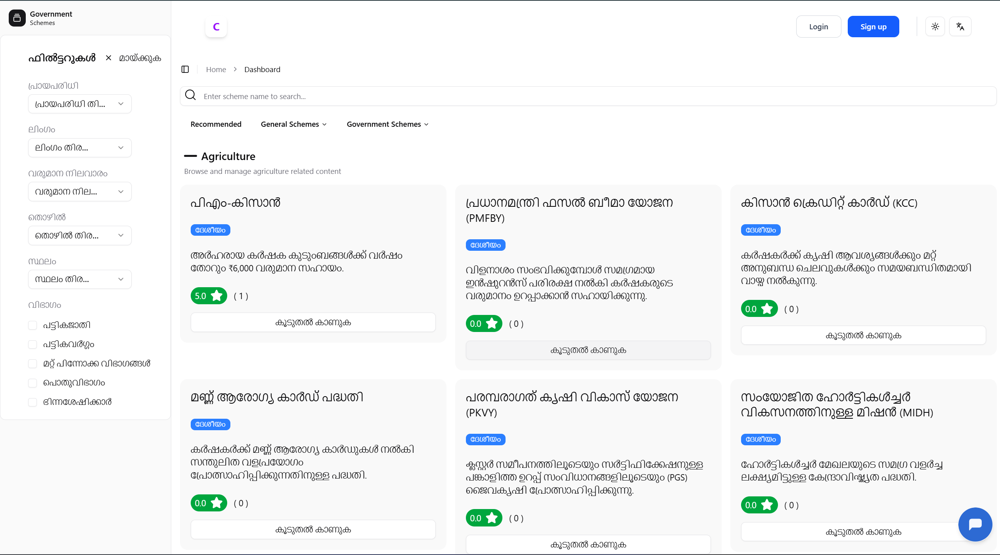
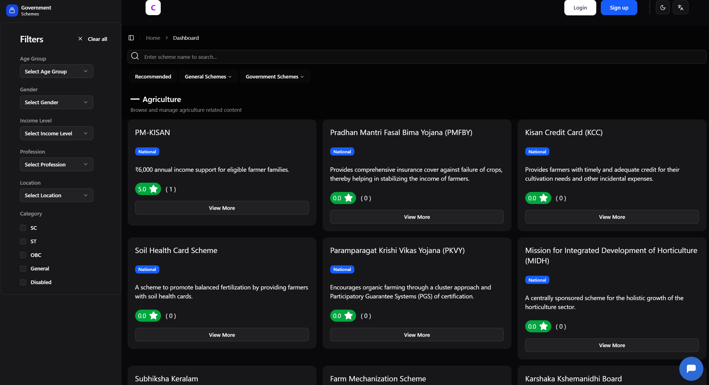
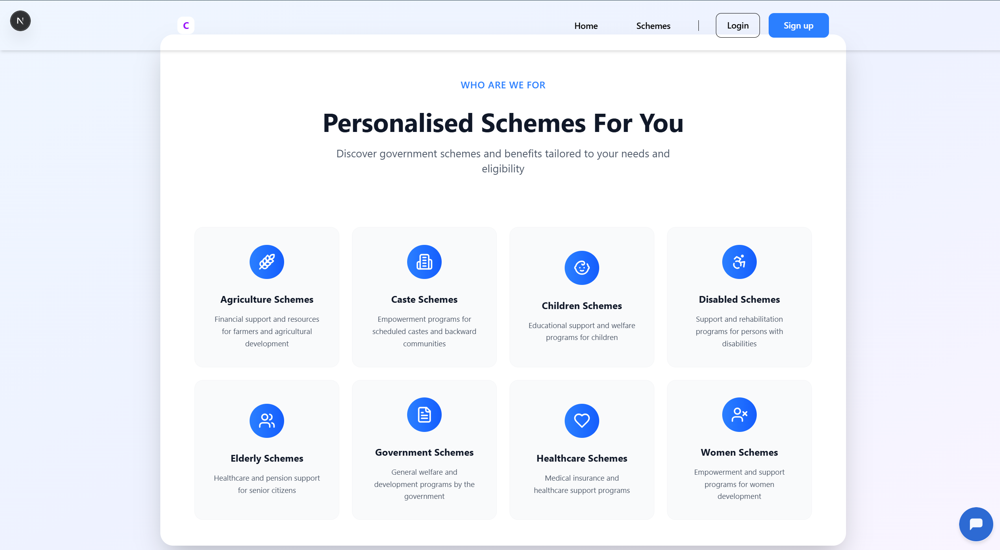
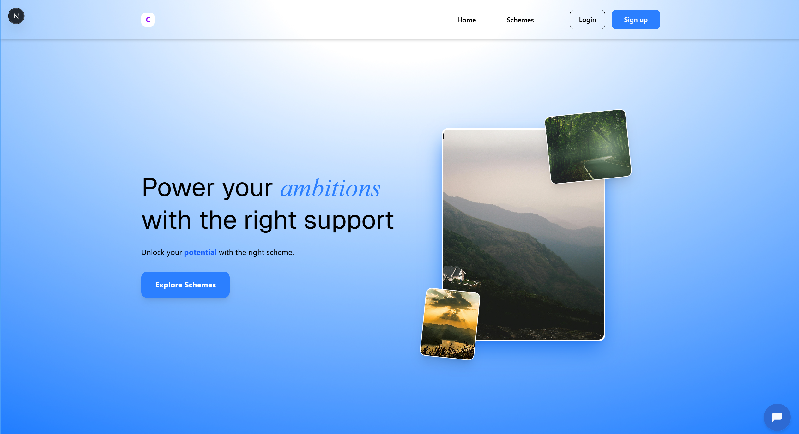

# 🚀 Modern Web Application

A sleek, high-performance web application built with [Next.js](https://nextjs.org), optimized for speed and user experience.

---

## 📸 Interface Preview

Take a look at the design system and core sections of the application:

| Feature Detail (Light) | Feature Detail (Dark) |
| :---: | :---: |
|  |  |
| *Light Theme Elements* | *Dark Theme Elements* |

### Key Sections
- **Main Entry:** 
- **Full View:** 

---

## ✨ Features

* **Next.js 14/15 Ready:** Utilizing the latest App Router architecture.
* **Performance First:** Automatic font optimization with `next/font`.
* **Responsive Design:** Looks great on all screen sizes.
* **Theming:** Built-in support for light and dark modes (see previews above).

---

## 🛠️ Getting Started

To get the development environment running locally, follow these steps:

1.  **Clone the repository**
2.  **Install dependencies:**
    ```bash
    npm install
    ```
3.  **Run the development server:**
    ```bash
    npm run dev
    # or
    yarn dev
    # or
    pnpm dev
    ```

Open [http://localhost:3000](http://localhost:3000) with your browser to see the result. You can start editing the page by modifying `app/page.js`.

---

## 📚 Technical Stack

- **Framework:** [Next.js](https://nextjs.org/)
- **Styling:** CSS/Tailwind (Standard Next.js Setup)
- **Typography:** [Geist Font Family](https://vercel.com/font)
- **Deployment:** [Vercel](https://vercel.com/new)

---

## 🚀 Deployment

The easiest way to deploy this project is via the **Vercel Platform**:

1. Push your code to GitHub.
2. Import the project into [Vercel](https://vercel.com/new).
3. Your site is live!

---

*Developed with ❤️ using Next.js.*